# Resonant Architecture

> **Comprehensive technical architecture for the social mathematics platform**

## Overview

Resonant is architected as a **hybrid client-server system** with heavy emphasis on client-side computation and minimal server dependencies. The system is designed to scale from thousands to millions of users while maintaining mathematical precision and real-time performance.

## System Architecture

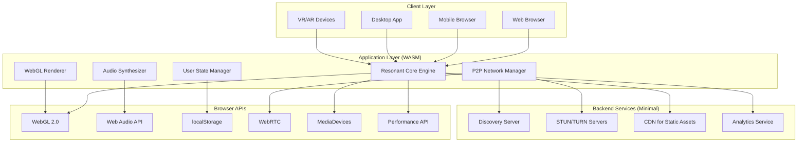

## Core Components

### 1. Fractal Engine (`src/fractals.rs`)

The mathematical heart of Resonant, implementing multiple fractal algorithms optimized for real-time generation.

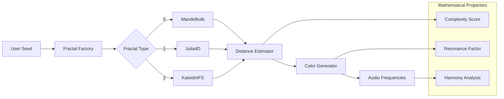

#### Fractal Types

**Mandelbulb**
- 3D extension of Mandelbrot set
- Time-varying power parameter
- Spherical coordinate transformation
- Optimized for mobile GPUs

**Julia4D**
- 4-dimensional Julia sets
- Quaternion-like mathematics
- Dynamic constant evolution
- Complex harmonic patterns

**KaleidoIFS**
- Iterated Function Systems
- Kaleidoscopic folding operations
- Real-time parameter variation
- Fractal dimension analysis

### 2. Rendering Pipeline (`src/lib.rs`)

Real-time WebGL 2.0 rendering optimized for 60fps performance across devices.

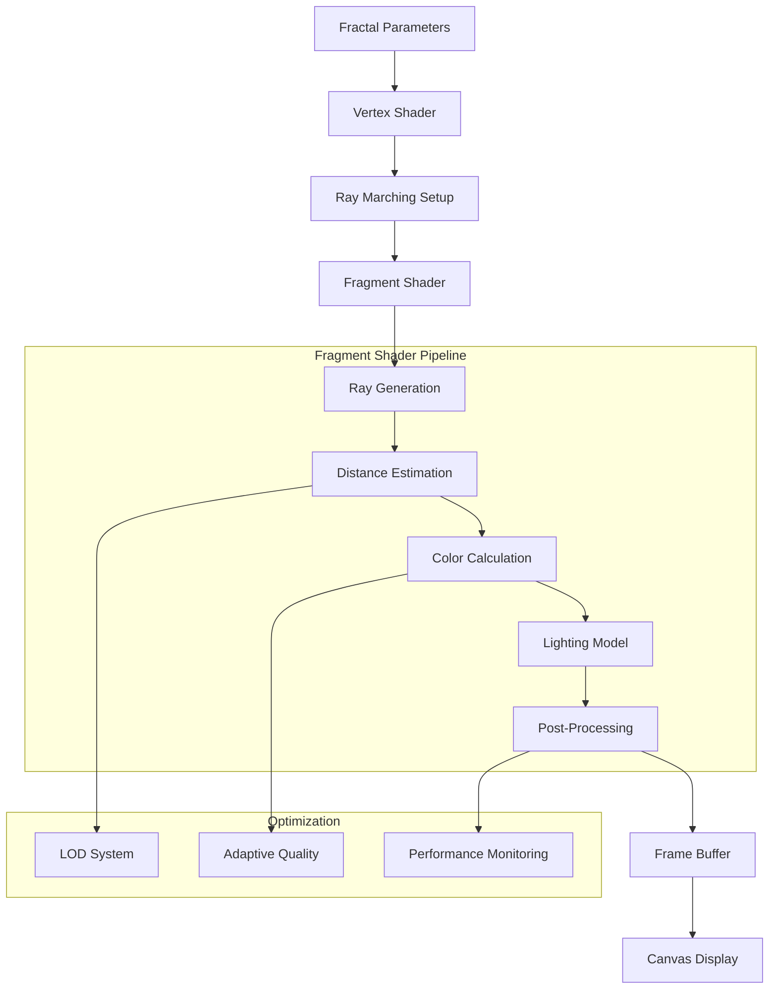

#### Shader Architecture

```glsl
// Simplified fragment shader pipeline
float fractal_distance(vec3 pos, float time, float seed) {
    // Implementation varies by fractal type
    // Optimized for mobile GPUs
}

vec3 calculate_color(int fractal_type, float distance, vec3 position) {
    // HSV color space for smooth transitions
    // Time-based evolution
    // User transform influence
}

void main() {
    // Ray marching loop
    // Normal calculation
    // Lighting application
    // Final color output
}
```

### 3. Audio Synthesis Engine (`src/audio.rs`)

Real-time audio generation from fractal geometry using Web Audio API.

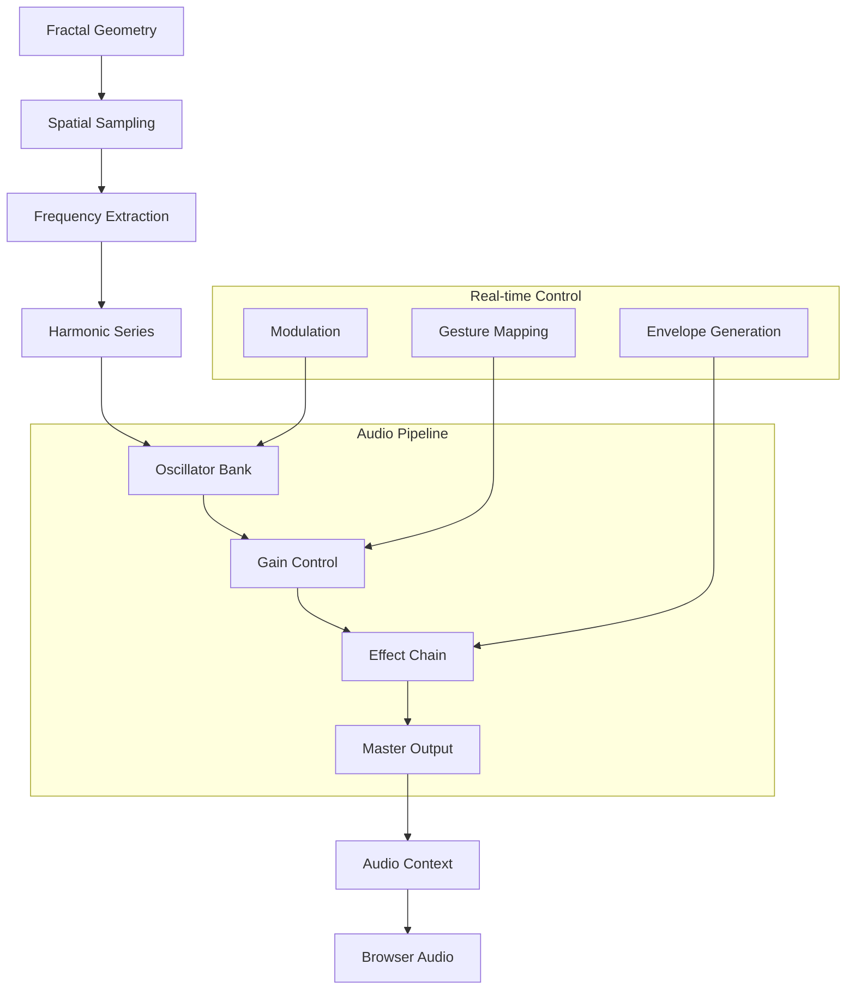

#### Audio Features

- **Frequency Mapping**: Fractal distance → pitch
- **Harmonic Generation**: Color → timbre
- **Real-time Modulation**: Gestures → audio parameters
- **Spatial Audio**: 4D position → stereo field

### 4. User State Management (`src/user.rs`)

Persistent user data with privacy-first design and local-first architecture.

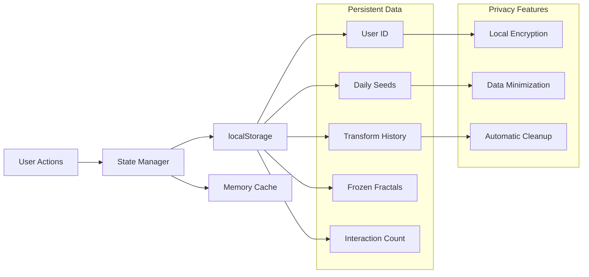

### 5. Networking Layer (`src/network.rs`)

P2P-first networking with fallback to relay servers for maximum decentralization.

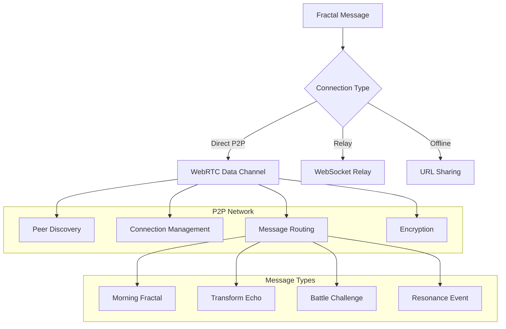

## Data Flow Architecture

### Daily Fractal Generation

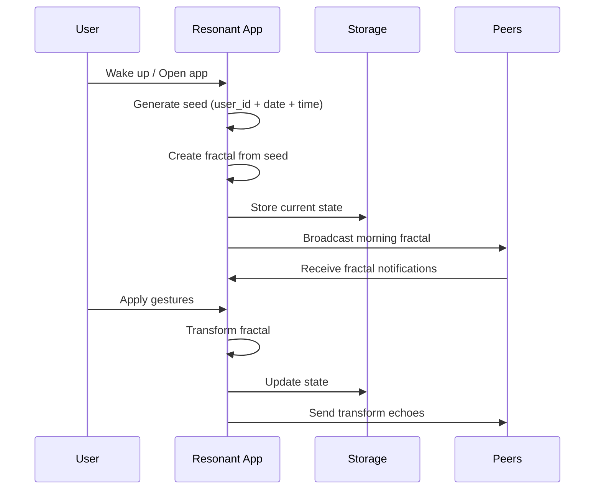

### Social Interaction Flow

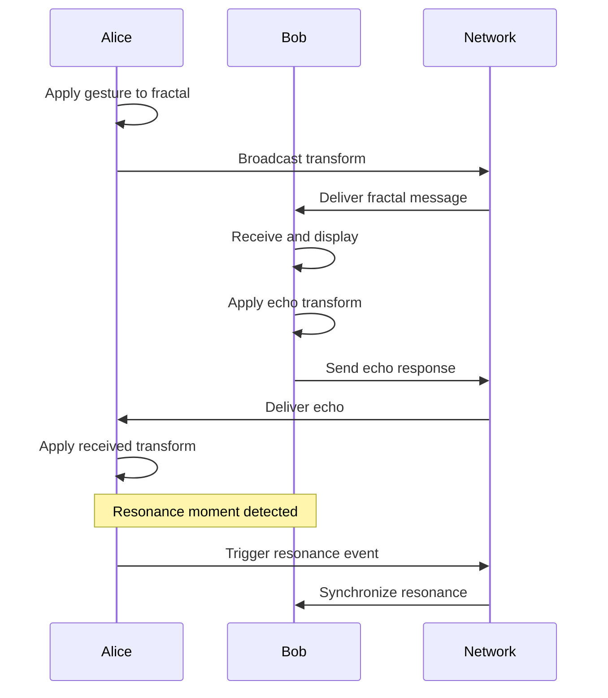

## Performance Characteristics

### Client-Side Performance

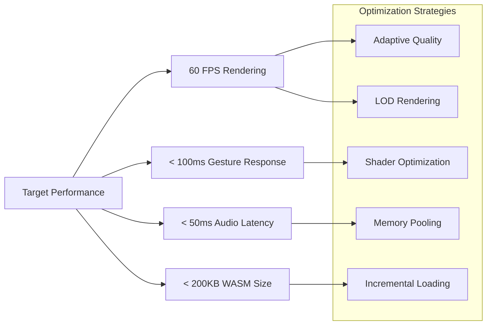

### Scalability Design

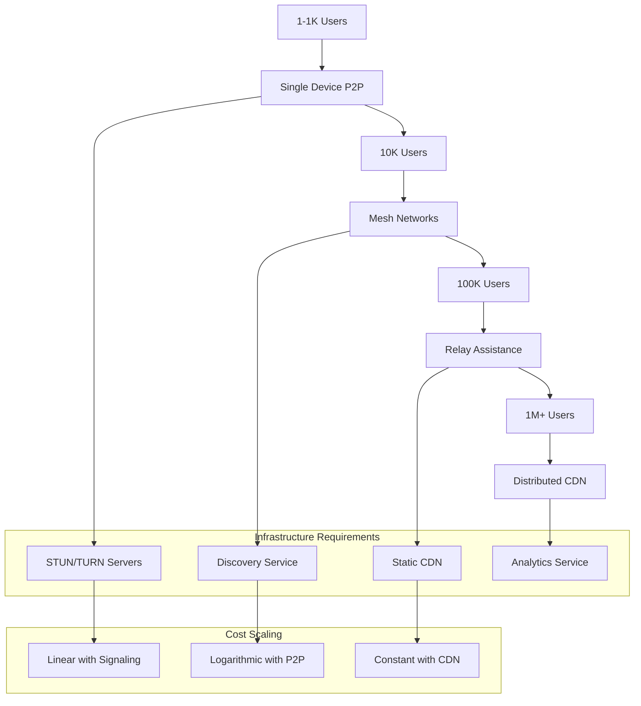

## Security Architecture

### Privacy-First Design

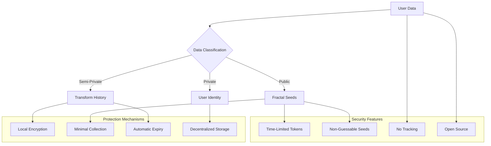

### Threat Model

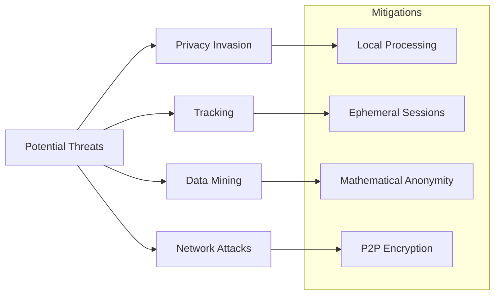

## Deployment Architecture

### Multi-Platform Strategy

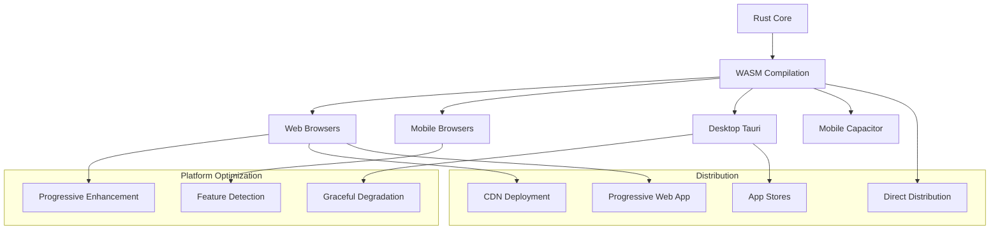

### Infrastructure Requirements

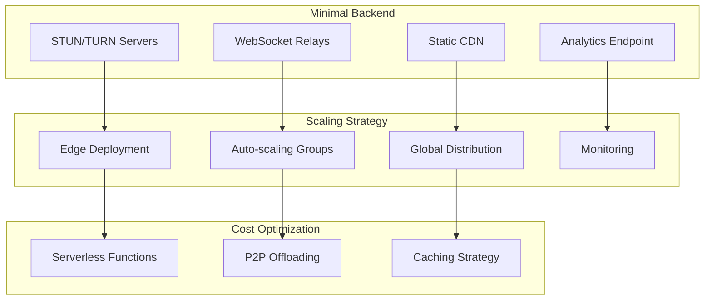

## Development Workflow

### Build Pipeline

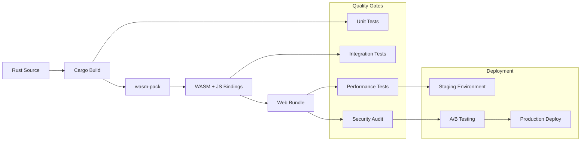

### Testing Strategy

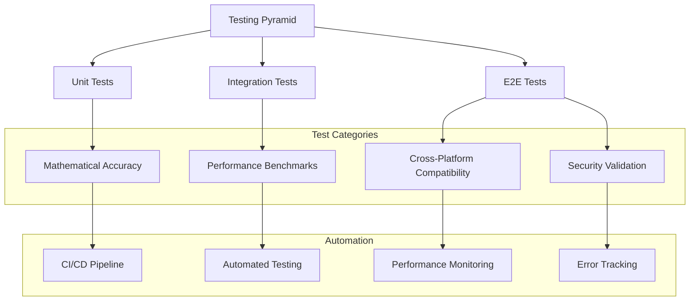

## Monitoring and Observability

### Application Metrics

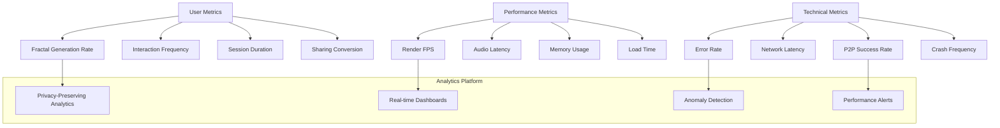

## Future Architecture Evolution

### Roadmap Integration

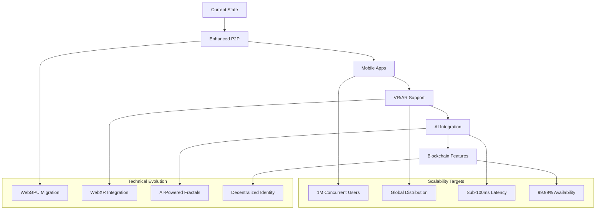

---

**This architecture enables Resonant to scale from a proof-of-concept to a global platform while maintaining mathematical precision, user privacy, and viral growth potential.**