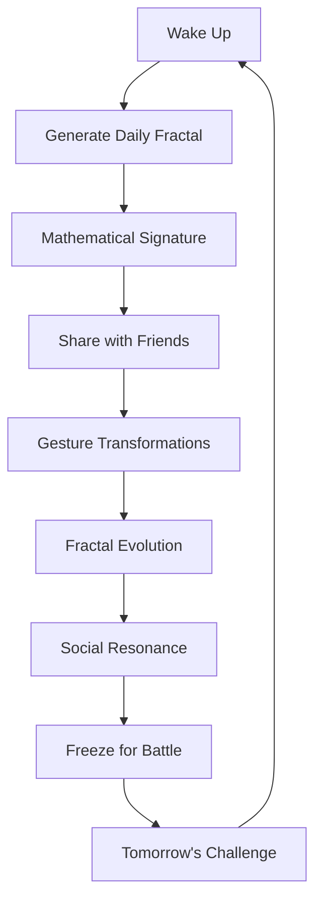
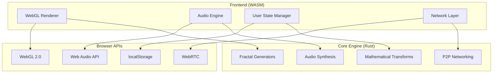

# Resonant - Social Mathematics

> **Experience your mathematical soul through 4D fractals that evolve with social interactions**

[](https://www.rust-lang.org/)
[](https://webassembly.org/)
[](https://www.khronos.org/webgl/)

## What is Resonant?

Resonant is a revolutionary social platform where human connection happens through **mathematical beauty** instead of words. Each day, you receive a unique 4D fractal - your personal geometric signature that evolves through interactions with friends. No text, no comments, just pure mathematical resonance between consciousness.

### ✨ Core Concept



## 🎯 Features

### Daily Mathematical Soul
- **Unique 4D fractals** generated from user ID + date + wake time
- **Three fractal types**: Mandelbulb, Julia4D, and KaleidoIFS
- **Time evolution** - your fractal changes throughout the day
- **Complexity scoring** based on interactions and mathematical properties

### Social Mathematics
- **Gesture-based communication** - swipe, tilt, smile to transform fractals
- **Echo responses** - friends can transform your fractal and send it back
- **Resonance moments** - when multiple people interact simultaneously
- **Network effects** - late risers get more complex fractals from accumulated interactions

### Viral Mechanics
- **Zero-friction sharing** - instant URL sharing with embedded fractal data
- **Freeze system** - save your best fractal as tomorrow's champion
- **Battle mechanics** - mathematical complexity contests between fractals
- **Time-limited tokens** - secure sharing with automatic expiration

### Audio Synthesis
- **Fractal-to-music conversion** - geometric patterns become harmonic frequencies
- **Real-time audio** - your fractal sings as it evolves
- **Gesture feedback** - audio responses to touch interactions

## 🚀 Quick Start

### Prerequisites
- [Rust](https://rustup.rs/) (latest stable)
- [wasm-pack](https://rustwasm.github.io/wasm-pack/installer/)
- Modern web browser with WebGL support

### Installation

```bash
# Clone the repository
git clone https://github.com/cschladetsch/Res-One.git
cd Res-One

# Build the WASM package
wasm-pack build --target web

# Start local server
python -m http.server 8000

# Open browser
open http://localhost:8000
```

### Testing Multiplayer

```bash
# Visit the multiplayer test page
open http://localhost:8000/test-multiplayer.html
```

## 🎮 Usage

### Basic Interactions

- **Touch/Click**: Random fractal transformation
- **Swipe**: Directional rotation in 4D space
- **Keyboard Shortcuts**:
  - `Space`: Random gesture
  - `f`: Freeze current fractal
  - `s`: Share fractal URL

### Advanced Features

1. **Freeze Your Fractal**: Save today's evolved fractal as your champion
2. **Share Mathematical Soul**: Generate time-limited URLs for friends
3. **Battle Mode**: Compare fractal complexity with mathematical scoring
4. **Audio Experience**: Enable sound for fractal-generated music

## 🏗️ Architecture

Resonant is built with a **modular Rust architecture** that compiles to WebAssembly for universal deployment:



### Key Technologies

- **Rust**: Memory-safe systems programming for the core engine
- **WebAssembly**: Universal deployment across all platforms
- **WebGL 2.0**: High-performance 3D fractal rendering
- **Web Audio API**: Real-time audio synthesis
- **nalgebra**: Linear algebra and mathematical operations
- **serde**: Serialization for data persistence and sharing

## 📁 Project Structure

```
Resonant/
├── src/
│   ├── lib.rs           # Main WASM interface
│   ├── fractals.rs      # Fractal generation algorithms
│   ├── audio.rs         # Audio synthesis engine
│   ├── user.rs          # User state and persistence
│   └── network.rs       # P2P networking and sharing
├── pkg/                 # Generated WASM package
├── index.html          # Main application
├── test-multiplayer.html # Multiplayer testing
├── MANIFESTO.md        # Vision and philosophy
├── ARCHITECTURE.md     # Detailed technical architecture
└── technical-design-01.md # Initial design document
```

## 🔬 Technical Deep Dive

### Fractal Generation

Resonant implements three mathematically distinct fractal types:

1. **Mandelbulb**: 3D extension of the Mandelbrot set with time-varying power
2. **Julia4D**: 4-dimensional Julia sets with quaternion-like mathematics
3. **KaleidoIFS**: Iterated Function Systems with kaleidoscopic folding

Each fractal type has unique visual characteristics and mathematical properties that create different aesthetic experiences.

### Mathematical Transforms

User gestures are converted to mathematical transformations:

```rust
// Gesture → Matrix transformation
let transform = match gesture_type {
    "swipe" => rotation_matrix(direction, intensity),
    "pinch" => scale_matrix(intensity),
    "tilt" => perspective_matrix(direction, intensity),
    "smile" => brightness_matrix(intensity), // 4D translation
};
```

### Audio Synthesis

Fractals are converted to audio through **geometric sampling**:

1. Sample fractal at key points in 4D space
2. Extract distance and color information
3. Map to frequencies and harmonics
4. Generate real-time audio through Web Audio API

## 🌐 Deployment

### Web Deployment
```bash
# Build optimized release
wasm-pack build --target web --release

# Deploy to static hosting (Netlify, Vercel, GitHub Pages)
# No server required - purely client-side
```

### Platform Support

- ✅ **Web Browsers**: Chrome, Firefox, Safari, Edge (WebGL 2.0 required)
- ✅ **Mobile**: iOS Safari, Android Chrome (touch optimized)
- ✅ **Desktop**: Native via Tauri (future)
- ✅ **Progressive Web App**: Installable on all platforms

## 🔮 Future Roadmap

### Phase 1: Core Platform (Current)
- [x] Basic fractal generation and interaction
- [x] User persistence and daily fractals
- [x] Sharing and URL tokens
- [x] Audio synthesis foundation

### Phase 2: Social Features
- [ ] Real-time P2P networking via WebRTC
- [ ] Friend circles and group fractals
- [ ] Biometric input integration (camera, microphone)
- [ ] Enhanced battle mechanics

### Phase 3: Viral Growth
- [ ] Social media integrations
- [ ] Fractal marketplace and NFT support
- [ ] Mobile app store deployment
- [ ] Global resonance events

### Phase 4: Platform Evolution
- [ ] VR/AR fractal experiences
- [ ] AI-powered fractal evolution
- [ ] Cross-platform synchronization
- [ ] Decentralized architecture

## 🤝 Contributing

We welcome contributions to the Resonant platform! Please see our [contribution guidelines](CONTRIBUTING.md) for details.

### Development Setup

```bash
# Install Rust toolchain
curl --proto '=https' --tlsv1.2 -sSf https://sh.rustup.rs | sh

# Install wasm-pack
curl https://rustwasm.github.io/wasm-pack/installer/init.sh -sSf | sh

# Clone and build
git clone https://github.com/cschladetsch/Res-One.git
cd Res-One
wasm-pack build --target web --dev
```

### Testing

```bash
# Run Rust tests
cargo test

# Start local development server
python -m http.server 8000

# Test in browser
open http://localhost:8000/test-multiplayer.html
```

## 📄 License

This project is licensed under the MIT License - see the [LICENSE](LICENSE) file for details.

## 🎨 Philosophy

> "Mathematics is the only truly universal language. Resonant makes that language visible, audible, and shareable. Every human becomes a node in the most beautiful network ever created: the mathematical symphony of conscious beings learning to resonate."

Read our full [MANIFESTO](MANIFESTO.md) for the complete vision behind Resonant.

## 🔗 Links

- **Live Demo**: [resonant.app](https://resonant.app) (coming soon)
- **Documentation**: [docs.resonant.app](https://docs.resonant.app) (coming soon)
- **Community**: [Discord](https://discord.gg/resonant) (coming soon)
- **Twitter**: [@ResonantApp](https://twitter.com/ResonantApp) (coming soon)

---

**Built with ❤️ and mathematical beauty**

*Resonant: Where consciousness meets mathematics*