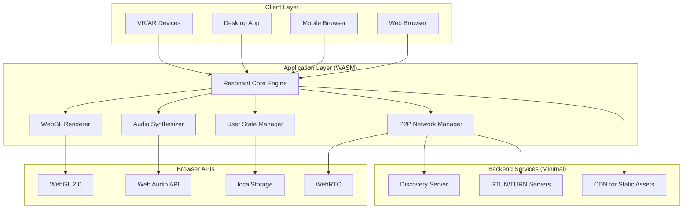

# Resonant Architecture

## System architecture

```mermaid
graph TB
    subgraph "Client Layer"
        A[Web Browser]
        B[Mobile Browser]
        C[Desktop App]
        D[VR/AR Devices]
    end
    subgraph "Application Layer (WASM)"
        E[Resonant Core Engine]
        F[WebGL Renderer]
        G[Audio Synthesizer]
        H[P2P Network Manager]
        I[User State Manager]
    end
    subgraph "Browser APIs"
        J[WebGL 2.0]
        K[Web Audio API]
        L[localStorage]
        M[WebRTC]
    end
    subgraph "Backend Services (Minimal)"
        P[Discovery Server]
        Q[STUN/TURN Servers]
        R[CDN for Static Assets]
    end
    A --> E
    B --> E
    C --> E
    D --> E
    E --> F
    E --> G
    E --> H
    E --> I
    F --> J
    G --> K
    I --> L
    H --> M
    H --> P
    H --> Q
    E --> R
```
